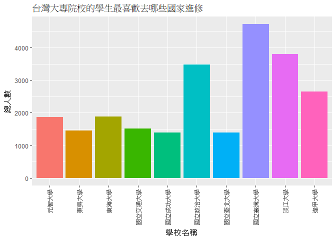

106-2 大數據分析方法 作業二
================
林姿頻

作業完整說明[連結](https://docs.google.com/document/d/1aLGSsGXhgOVgwzSg9JdaNz2qGPQJSoupDAQownkGf_I/edit?usp=sharing)

學習再也不限定在自己出生的國家，台灣每年有許多學生選擇就讀國外的大專院校，同時也有人多國外的學生來台灣就讀，透過分析[大專校院境外學生人數統計](https://data.gov.tw/dataset/6289)、[大專校院本國學生出國進修交流數](https://data.gov.tw/dataset/24730)、[世界各主要國家之我國留學生人數統計表](https://ws.moe.edu.tw/Download.ashx?u=C099358C81D4876CC7586B178A6BD6D5062C39FB76BDE7EC7685C1A3C0846BCDD2B4F4C2FE907C3E7E96F97D24487065577A728C59D4D9A4ECDFF432EA5A114C8B01E4AFECC637696DE4DAECA03BB417&n=4E402A02CE6F0B6C1B3C7E89FDA1FAD0B5DDFA6F3DA74E2DA06AE927F09433CFBC07A1910C169A1845D8EB78BD7D60D7414F74617F2A6B71DC86D17C9DA3781394EF5794EEA7363C&icon=..csv)可以了解103年以後各大專院校國際交流的情形。請同學分析以下議題，並以視覺化的方式呈現分析結果，呈現103年以後大專院校國際交流的情形。

來台境外生分析
--------------

### 資料匯入與處理

``` r
#這是R Code Chunk
library(readr)
library(dplyr)
```

    ## 
    ## Attaching package: 'dplyr'

    ## The following objects are masked from 'package:stats':
    ## 
    ##     filter, lag

    ## The following objects are masked from 'package:base':
    ## 
    ##     intersect, setdiff, setequal, union

``` r
C103 <- read_csv("103_ab103_C.csv")
```

    ## Parsed with column specification:
    ## cols(
    ##   洲別 = col_character(),
    ##   國別 = col_character(),
    ##   `學位生-正式修讀學位外國生` = col_integer(),
    ##   `學位生-僑生(含港澳)` = col_integer(),
    ##   `學位生-正式修讀學位陸生` = col_integer(),
    ##   `非學位生-外國交換生` = col_integer(),
    ##   `非學位生-外國短期研習及個人選讀` = col_integer(),
    ##   `非學位生-大專附設華語文中心學生` = col_integer(),
    ##   `非學位生-大陸研修生` = col_integer(),
    ##   `非學位生-海青班` = col_integer(),
    ##   境外專班 = col_integer()
    ## )

``` r
C104 <- read_csv("104_ab104_C.csv")
```

    ## Parsed with column specification:
    ## cols(
    ##   洲別 = col_character(),
    ##   國別 = col_character(),
    ##   `學位生-正式修讀學位外國生` = col_integer(),
    ##   `學位生-僑生(含港澳)` = col_integer(),
    ##   `學位生-正式修讀學位陸生` = col_integer(),
    ##   `非學位生-外國交換生` = col_integer(),
    ##   `非學位生-外國短期研習及個人選讀` = col_integer(),
    ##   `非學位生-大專附設華語文中心學生` = col_integer(),
    ##   `非學位生-大陸研修生` = col_integer(),
    ##   `非學位生-海青班` = col_integer(),
    ##   境外專班 = col_integer()
    ## )

``` r
C105 <- read_csv("105_ab105_C.csv")
```

    ## Parsed with column specification:
    ## cols(
    ##   洲別 = col_character(),
    ##   國別 = col_character(),
    ##   學位生_正式修讀學位外國生 = col_integer(),
    ##   `學位生_僑生(含港澳)` = col_integer(),
    ##   學位生_正式修讀學位陸生 = col_integer(),
    ##   非學位生_外國交換生 = col_integer(),
    ##   非學位生_外國短期研習及個人選讀 = col_integer(),
    ##   非學位生_大專附設華語文中心學生 = col_integer(),
    ##   非學位生_大陸研修生 = col_integer(),
    ##   非學位生_海青班 = col_integer(),
    ##   境外專班 = col_integer()
    ## )

``` r
C106 <- read_csv("106_ab105_C.csv")
```

    ## Parsed with column specification:
    ## cols(
    ##   洲別 = col_character(),
    ##   國別 = col_character(),
    ##   學位生_正式修讀學位外國生 = col_integer(),
    ##   `學位生_僑生(含港澳)` = col_integer(),
    ##   學位生_正式修讀學位陸生 = col_integer(),
    ##   非學位生_外國交換生 = col_integer(),
    ##   非學位生_外國短期研習及個人選讀 = col_integer(),
    ##   非學位生_大專附設華語文中心學生 = col_integer(),
    ##   非學位生_大陸研修生 = col_integer(),
    ##   非學位生_海青班 = col_integer(),
    ##   境外專班 = col_integer()
    ## )

``` r
C103$total<-rowSums(C103[,3:11],na.rm = T)
C104$total<-rowSums(C104[,3:11],na.rm = T)
C105$total<-rowSums(C105[,3:11],na.rm = T)
C106$total<-rowSums(C106[,3:11],na.rm = T)
CStudent<-merge(select(C103,"國別",total),
                select(C104,"國別",total),
                by = "國別",all=T)
CStudent<-merge(CStudent,
                select(C105,"國別",total),
                by = "國別",all=T)
CStudent<-merge(CStudent,
                select(C106,"國別",total),
                by = "國別",all=T)
```

    ## Warning in merge.data.frame(CStudent, select(C106, "國別", total), by = "國
    ## 別", : column names 'total.x', 'total.y' are duplicated in the result

``` r
names(CStudent)<-c("國別","total103","total104","total105","total106")
```

### 哪些國家來台灣唸書的學生最多呢？

``` r
#這是R Code Chunk
CStudent<-CStudent%>%
  mutate(總人數=rowSums(CStudent[,2:5]))%>%
  select(國別,總人數)%>%
  arrange(desc(總人數))
knitr::kable(head(CStudent,10))
```

| 國別     | 總人數 |
|:---------|:------:|
| 中國大陸 | 152524 |
| 馬來西亞 |  62031 |
| 香港     |  31940 |
| 日本     |  28200 |
| 越南     |  21670 |
| 澳門     |  20302 |
| 印尼     |  19620 |
| 南韓     |  16948 |
| 美國     |  14846 |
| 泰國     |  7035  |

### 哪間大學的境外生最多呢？

``` r
#這是R Code Chunk
S103<- read_csv("103_ab103_S.csv")
```

    ## Parsed with column specification:
    ## cols(
    ##   學校類型 = col_character(),
    ##   學校代碼 = col_character(),
    ##   學校名稱 = col_character(),
    ##   `學位生-正式修讀學位外國生` = col_integer(),
    ##   `學位生-僑生(含港澳)` = col_integer(),
    ##   `學位生-正式修讀學位陸生` = col_integer(),
    ##   `非學位生-外國交換生` = col_integer(),
    ##   `非學位生-外國短期研習及個人選讀` = col_integer(),
    ##   `非學位生-大專附設華語文中心學生` = col_integer(),
    ##   `非學位生-大陸研修生` = col_character(),
    ##   `非學位生-海青班` = col_integer(),
    ##   境外專班 = col_integer()
    ## )

``` r
S104<- read_csv("104_ab104_S.csv")
```

    ## Parsed with column specification:
    ## cols(
    ##   學校類型 = col_character(),
    ##   學校代碼 = col_character(),
    ##   學校名稱 = col_character(),
    ##   `學位生-正式修讀學位外國生` = col_integer(),
    ##   `學位生-僑生(含港澳)` = col_integer(),
    ##   `學位生-正式修讀學位陸生` = col_integer(),
    ##   `非學位生-外國交換生` = col_integer(),
    ##   `非學位生-外國短期研習及個人選讀` = col_integer(),
    ##   `非學位生-大專附設華語文中心學生` = col_integer(),
    ##   `非學位生-大陸研修生` = col_character(),
    ##   `非學位生-海青班` = col_integer(),
    ##   境外專班 = col_integer()
    ## )

``` r
S105<- read_csv("105_ab105_S.csv")
```

    ## Parsed with column specification:
    ## cols(
    ##   學校類型 = col_character(),
    ##   學校代碼 = col_character(),
    ##   學校名稱 = col_character(),
    ##   學位生_正式修讀學位外國生 = col_integer(),
    ##   `學位生_僑生(含港澳)` = col_integer(),
    ##   學位生_正式修讀學位陸生 = col_integer(),
    ##   非學位生_外國交換生 = col_integer(),
    ##   非學位生_外國短期研習及個人選讀 = col_integer(),
    ##   非學位生_大專附設華語文中心學生 = col_integer(),
    ##   非學位生_大陸研修生 = col_integer(),
    ##   非學位生_海青班 = col_integer(),
    ##   境外專班 = col_integer()
    ## )

``` r
S106<- read_csv("106_ab105_S.csv")
```

    ## Parsed with column specification:
    ## cols(
    ##   學校類型 = col_character(),
    ##   學校代碼 = col_character(),
    ##   學校名稱 = col_character(),
    ##   學位生_正式修讀學位外國生 = col_integer(),
    ##   `學位生_僑生(含港澳)` = col_integer(),
    ##   學位生_正式修讀學位陸生 = col_integer(),
    ##   非學位生_外國交換生 = col_integer(),
    ##   非學位生_外國短期研習及個人選讀 = col_integer(),
    ##   非學位生_大專附設華語文中心學生 = col_integer(),
    ##   非學位生_大陸研修生 = col_integer(),
    ##   非學位生_海青班 = col_integer(),
    ##   境外專班 = col_integer()
    ## )

``` r
S103$`非學位生-大陸研修生`<-as.numeric(gsub("…",NA,S103$`非學位生-大陸研修生`))
S104$`非學位生-大陸研修生`<-as.numeric(gsub("…",NA,S104$`非學位生-大陸研修生`))

S103$total<-rowSums(S103[,4:12],na.rm = T)
S104$total<-rowSums(S104[,4:12],na.rm = T)
S105$total<-rowSums(S105[,4:12],na.rm = T)
S106$total<-rowSums(S106[,4:12],na.rm = T)

SStudent<-merge(select(S103,"學校名稱",total),
                select(S104,"學校名稱",total),
                by = "學校名稱")
SStudent<-merge(SStudent,
                select(S105,"學校名稱",total),
                by = "學校名稱")
SStudent<-merge(SStudent,
                select(S106,"學校名稱",total),
                by = "學校名稱")
```

    ## Warning in merge.data.frame(SStudent, select(S106, "學校名稱", total), by =
    ## "學校名稱"): column names 'total.x', 'total.y' are duplicated in the result

``` r
names(SStudent)<-c("學校名稱","total103","total104","total105","total106")

SStudent<-SStudent%>%
  mutate(總人數=rowSums(SStudent[,2:5]))%>%
  select(學校名稱,總人數)%>%
  arrange(desc(總人數))
knitr::kable(head(SStudent,10))
```

| 學校名稱         | 總人數 |
|:-----------------|:------:|
| 國立臺灣師範大學 |  22113 |
| 國立臺灣大學     |  18199 |
| 中國文化大學     |  16074 |
| 銘傳大學         |  16057 |
| 淡江大學         |  13887 |
| 國立政治大學     |  11626 |
| 國立成功大學     |  10982 |
| 輔仁大學         |  9499  |
| 逢甲大學         |  9474  |
| 中原大學         |  7662  |

### 各個國家來台灣唸書的學生人數條狀圖

``` r
#這是R Code Chunk
library(ggplot2)
ggplot()+geom_bar(data=CStudent,
                  aes(x=國別,y=總人數),
                  stat = "identity") 
```

    ## Warning: Removed 38 rows containing missing values (position_stack).


### 各個國家來台灣唸書的學生人數面量圖

``` r
#這是R Code Chunk
library(choroplethr)
```

    ## Loading required package: acs

    ## Loading required package: stringr

    ## Loading required package: XML

    ## 
    ## Attaching package: 'acs'

    ## The following object is masked from 'package:dplyr':
    ## 
    ##     combine

    ## The following object is masked from 'package:base':
    ## 
    ##     apply

``` r
library(choroplethrMaps)
CCompare <- read_csv("CountriesComparisionTable.csv")
```

    ## Parsed with column specification:
    ## cols(
    ##   ISO3 = col_character(),
    ##   English = col_character(),
    ##   Taiwan = col_character()
    ## )

``` r
names(CCompare)<-c("ISO3","English","國別")
CCompare<-merge(CStudent,CCompare,by = "國別")
df = data.frame(region=CCompare$English, value=CCompare$總人數)
df<-df[!duplicated(df$region), ]
country_choropleth(df)
```

    ## Warning in super$initialize(country.map, user.df): Your data.frame contains
    ## the following regions which are not mappable: Unmatch, Singapore

    ## Warning: Column `region` joining character vector and factor, coercing into
    ## character vector

    ## Warning in self$bind(): The following regions were missing and are being
    ## set to NA: afghanistan, angola, moldova, madagascar, mali, montenegro,
    ## mauritania, burundi, niger, oman, qatar, western sahara, sierra leone,
    ## somaliland, somalia, suriname, chad, togo, east timor, trinidad and tobago,
    ## taiwan, the bahamas, vanuatu, zambia, albania, botswana, central african
    ## republic, democratic republic of the congo, northern cyprus, cyprus,
    ## djibouti, eritrea, gabon, georgia, ghana, antarctica, guinea, guinea
    ## bissau, equatorial guinea, guyana, jamaica, south korea, kosovo, lebanon,
    ## liberia, libya, lesotho


台灣學生國際交流分析
--------------------

### 資料匯入與處理

``` r
#這是R Code Chunk
library(readxl)
library(dplyr)
TWstudent<- read_excel("Student_RPT_07.xlsx")
```

### 台灣大專院校的學生最喜歡去哪些國家進修交流呢？

``` r
#這是R Code Chunk
TCstudent<-TWstudent%>%
  group_by(`對方學校(機構)國別(地區)`)%>%
  summarise(總人數=sum(小計))%>%
  arrange(desc(總人數))
knitr::kable(head(TCstudent,10))
```

| 對方學校(機構)國別(地區) | 總人數 |
|:-------------------------|:------:|
| 日本                     |  12430 |
| 中國大陸                 |  10429 |
| 美國                     |  8916  |
| 大陸地區                 |  5996  |
| 南韓                     |  2498  |
| 法國                     |  2415  |
| 大韓民國(南韓)           |  2131  |
| 德國                     |  1706  |
| 德意志聯邦共和國         |  1458  |
| 英國                     |  1416  |

### 哪間大學的出國交流學生數最多呢？

``` r
#這是R Code Chunk
TSstudent<-TWstudent%>%
  group_by(學校名稱)%>%
  summarise(總人數=sum(小計))%>%
  arrange(desc(總人數))
knitr::kable(head(TSstudent,10))
```

| 學校名稱     | 總人數 |
|:-------------|:------:|
| 國立臺灣大學 |  4719  |
| 淡江大學     |  3794  |
| 國立政治大學 |  3479  |
| 逢甲大學     |  2646  |
| 東海大學     |  1881  |
| 元智大學     |  1864  |
| 國立交通大學 |  1513  |
| 東吳大學     |  1457  |
| 國立成功大學 |  1397  |
| 國立臺北大學 |  1397  |

### 台灣大專院校的學生最喜歡去哪些國家進修交流條狀圖

``` r
#這是R Code Chunk
ggplot()+geom_bar(data=TSstudent,
                  aes(x=學校名稱,y=總人數),
                  stat = "identity") 
```



### 台灣大專院校的學生最喜歡去哪些國家進修交流面量圖

``` r
#這是R Code Chunk
```

台灣學生出國留學分析
--------------------

### 資料匯入與處理

``` r
#這是R Code Chunk
twc<- read_csv("105fuck.csv")
```

    ## Warning: Missing column names filled in: 'X4' [4], 'X5' [5], 'X6' [6]

    ## Parsed with column specification:
    ## cols(
    ##   洲別 = col_character(),
    ##   國別 = col_character(),
    ##   總人數 = col_number(),
    ##   X4 = col_character(),
    ##   X5 = col_character(),
    ##   X6 = col_character()
    ## )

``` r
twc[,4:6]<-NULL
```

### 台灣學生最喜歡去哪些國家留學呢？

``` r
#這是R Code Chunk
twc<-twc%>%
  select("國別","總人數")%>%
  arrange(desc(總人數))
knitr::kable(head(twc,10))
```

| 國別     | 總人數 |
|:---------|:------:|
| 美國     |  21127 |
| 澳大利亞 |  13582 |
| 日本     |  8444  |
| 加拿大   |  4827  |
| 英國     |  3815  |
| 德國     |  1488  |
| 紐西蘭   |  1106  |
| 波蘭     |   561  |
| 馬來西亞 |   502  |
| 奧地利   |   419  |

### 台灣學生最喜歡去哪些國家留學面量圖

``` r
#這是R Code Chunk
```

綜合分析
--------

請問來台讀書與離台讀書的來源國與留學國趨勢是否相同(5分)？想來台灣唸書的境外生，他們的母國也有很多台籍生嗎？請圖文並茂說明你的觀察(10分)。
